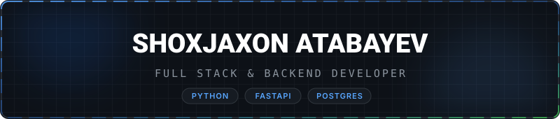

<div align="center">

  <!-- Glassmorphic Platinum & Charcoal Gray Header SVG Banner -->
  

  <br/><br/>

  <!-- Dynamic Typing SVG (Frosty Silver Metallic Text) -->
  <a href="https://github.com/shoxjaxon-atabayev">
    
  </a>

  <br/><br/>

  <!-- Minimalist Monochromatic Glass Social Badges -->
  <a href="https://t.me/shoxjaxon_atabayev" target="_blank">
    
  </a>
  &nbsp;
  <a href="https://linkedin.com/in/shoxjaxon-atabayev" target="_blank">
    
  </a>
  &nbsp;
  <a href="https://instagram.com/19shokh" target="_blank">
    
  </a>
  &nbsp;
  <a href="mailto:shoxjaxonatabaev@gmail.com">
    
  </a>

</div>

<br/>

---

###  &nbsp; ABOUT ME

```json
{
  "developer": {
    "name": "Shoxjaxon Atabayev",
    "role": "Full Stack & Backend Developer",
    "focus": ["API Architecture", "Scalable Systems", "Database Optimization"],
    "location": "Uzbekistan",
    "principles": ["Clean Architecture", "Code Quality", "System Reliability"]
  }
}
```

---

###  &nbsp; TECH STACK

<p align="center">
  
  
  
  
  
  
  
  
  
  
</p>

---

###  &nbsp; METRICS &amp; ACTIVITY

<p align="center">
  
</p>

<br/>

<p align="center">
  
  &nbsp;&nbsp;
  
</p>

---

<div align="center">

  <!-- Glassmorphic Silver Metallic Footer SVG -->
  

</div>
