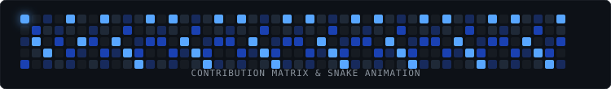

<div align="center">

  <!-- Premium Local SVG Header Banner (100% Reliable & Always Renders) -->
  

  <br/><br/>

  <!-- Dynamic Typing SVG Animation -->
  <a href="https://github.com/shoxjaxon-atabayev">
    
  </a>

  <br/><br/>

  <!-- Social Links / Connect Badges -->
  <a href="https://t.me/shoxjaxon_atabayev" target="_blank">
    
  </a>
  &nbsp;
  <a href="https://linkedin.com/in/shoxjaxon-atabayev" target="_blank">
    
  </a>
  &nbsp;
  <a href="https://instagram.com/19shokh" target="_blank">
    
  </a>
  &nbsp;
  <a href="mailto:shoxjaxonatabaev@gmail.com">
    
  </a>

</div>

<br/>

---

### ⚡ About Me

```json
{
  "developer": {
    "name": "Shoxjaxon Atabayev",
    "role": "Full Stack & Backend Developer",
    "focus": ["API Architecture", "Scalable Web Systems", "Database Optimization"],
    "location": "Uzbekistan",
    "passions": ["Clean Code", "Open Source", "System Performance"]
  }
}
```

---

### 🧰 Tech Stack & Tools

<p align="center">
  <b>Backend & Databases</b><br/>
  
</p>

<p align="center">
  <b>Frontend & Web</b><br/>
  
</p>

<p align="center">
  <b>DevOps, Infrastructure & Tools</b><br/>
  
</p>

---

### 📊 GitHub Activity & Metrics

<p align="center">
  
</p>

<br/>

<p align="center">
  
  &nbsp;&nbsp;
  
</p>

<p align="center">
  
</p>

---

### 🐍 Contribution Snake Game

<p align="center">
  <picture>
    <source media="(prefers-color-scheme: dark)" srcset="https://raw.githubusercontent.com/shoxjaxon-atabayev/shoxjaxon-atabayev/output/github-contribution-grid-snake-dark.svg">
    <source media="(prefers-color-scheme: light)" srcset="https://raw.githubusercontent.com/shoxjaxon-atabayev/shoxjaxon-atabayev/output/github-contribution-grid-snake.svg">
    
  </picture>
</p>

---

<div align="center">

  

</div>
