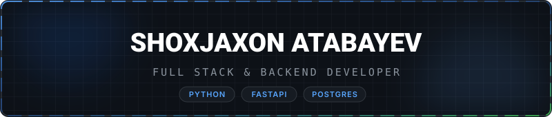

  <!-- Glassmorphic Platinum & Charcoal Gray Header SVG Banner -->
  

    

  <!-- Dynamic Typing SVG (Frosty Silver Metallic Text) -->
  

    
 
  <!-- Minimalist Monochromatic Glass Social Badges -->
  
  &nbsp;
  
  &nbsp;
  
  &nbsp;
  

 

---

###  &nbsp; ABOUT ME

  

---

###  &nbsp; TECH STACK &amp; TOOLING

  <b>Languages &amp; Backend Frameworks</b>  
  
  
  
  
  
  
  
  

  <b>Databases, Cloud &amp; Infrastructure</b>  
  
  
  
  
  
  
  
  

  <b>Linux &amp; System</b>  
  
  
  
  
  
  
  

  <b>Developer Environment &amp; Tools</b>  
  
  
  
  
  
  
  
  

---

  <!-- Glassmorphic Silver Metallic Footer SVG -->
  

